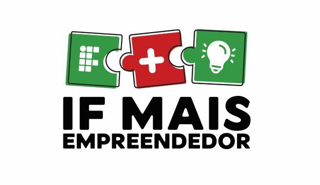
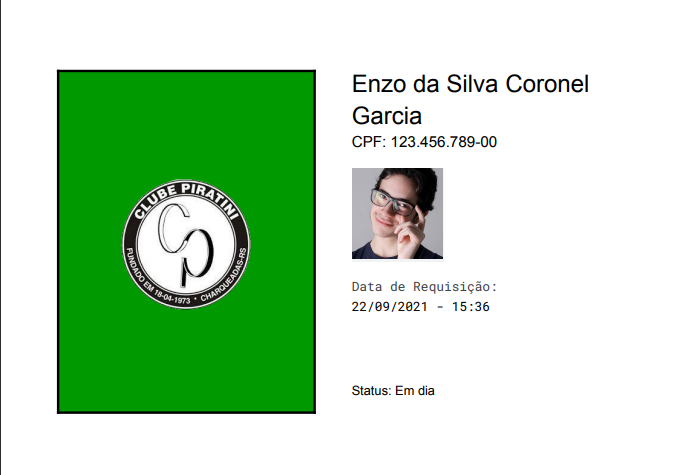

# Controle de sócios
Sumário:

- [Sobre](#sobre)

  - [IF Mais Empreendedor](#if-mais-empreendedor)
  - [Controle de Sócios](#controle-de-socios)
    - [Parceria](#parceria)
    - [Escopo](#escopo)

- [Tecnologias](#tecnologias)

  - [Ambiente](#ambiente)

- [Funcionamento](#funcionamento)

  
> Andre del Mestre

## Sobre

<h3 id="if-mais-empreendedor"> IF Mais Empreendedor </h3>

Este projeto foi desenvolvido durante o programa [IF Mais Empreendedor](https://portal.ifsuldeminas.edu.br/index.php/noticias-proex/4175-if-mais-empreendedor-nacional-2021), iniciativa do Instituto Federal de Educação, Ciência e Tecnologia do Sul de Minas. O programa visa ajudar empresas e empreendedores afetados negativamente devido a pandemia do COVID-19, com isso os bolsistas são estimulados, sob orientação, para planejar e realizar atividades que estímulem o crescimento de negócios que aderiram ao programa, desenvolvendo assim o perfil requisitado pelo mercado nos alunos, e desenvolvendo a economia de suas respectivas regiões.

<h3 id="controle-de-socios"> Controle de Sócios </h3>

Para realização do projeto, foi necessário pesquisar e analisar possíveis negócios interessados na proposta, essa pesquisa se deu na cidade de Charqueadas, no Rio Grande do Sul. 

<h4 id="parceria"> Parceria </h4>

O parceiro no qual aceitou a proposta, foi o **Clube Piratini**, um antigo e conceituado clube na cidade de Charqueadas. Possui membros de diversas cidades da região carbonífera, e está atualmente em crescimento.

<h4 id="escopo"> Escopo </h4>

Após o primeiro contato com o clube, foi apresentado um problema de controle de acesso no clube, devido a falta de uma forma de identificação na entrada, onde havia entrada irregular de pessoas, como por exemplo: assumir ser algum sócio ou dependente.

Com base nisso, o escopo do projeto, se deu em criar um sistema de identificação para o controle de acesso de sócios no clube, através de um cartão virtual.

Segue abaixo um exemplo do cartão:

<h2 id="tecnologias"> Tecnologias </h2>

Para o desenvolvimento da aplicação, foi utilizado o [Google Apps Script](https://developers.google.com/apps-script), uma tecnologia do Google, que permite a interação, criação de funções e automatização do Workspace.

> O Apps Script é a única plataforma com poucos códigos que facilita o desenvolvimento de soluções empresariais para integrar, automatizar e ampliar os recursos no Google Workspace. Com o Apps Script, os usuários empresariais podem desenvolver soluções personalizadas no Google Workspace, mesmo sem experiência profissional em desenvolvimento. Esse recurso está disponível para todas as pessoas que têm uma conta do Gmail. 
>
> **Google**

Tal ferramenta permite a criação de sistemas de gestão de maneira gratuita, pois basta programar o apps script para que as planilhas e demais ferramentas, possuam o comportamento de uma ERP. Deste jeito, torna-se sustentavel para o negócio, pois elimina as necessidades de instalar e manter uma infraestrutura para o funcionamento do negócio.

<h3 id="ambiente"> Ambiente </h3>

O apps script é uma plataforma Javascript na nuvem que permite a integração de diversas ferramentas Google. Acessada atráves da nuvem, diversos projetos podem ser criados, cada um com arquivos bases diferentes e/ou funções dintintas. O ambiente pode ser acessado em qualquer navegador web pelo [link](https://script.google.com/home/my). Os scripts utilizados no sistema podem ser encontrados na pasta `Source` . 

Um ponto importante a ser ressaltado é que a extensão dos arquivos no Apps Script são do tipo `.gs` e não `.js`, o Google Script é baseado no ECMAScript, por isso a sintaxe e estrutra é a mesma que arquivos do tipo `.js`. 

<h3 id="funcionamento">Como funciona</h3>

Abaixo segue um vídeo de apresentação da proposta:

Quando é realizado uma requisição pelo formulário, o sistema envia para um dos e-mails registrados na planilha um arquivo PDF, que é gerado no Google docs, para o Gmail associado ao CPF do sócio. Necessitando de um registro prévio no sistema, conforme demonstrado no vídeo.

Todo controle de inserção, delete, e update de dados são realizados através de planilhas.

